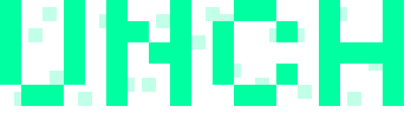
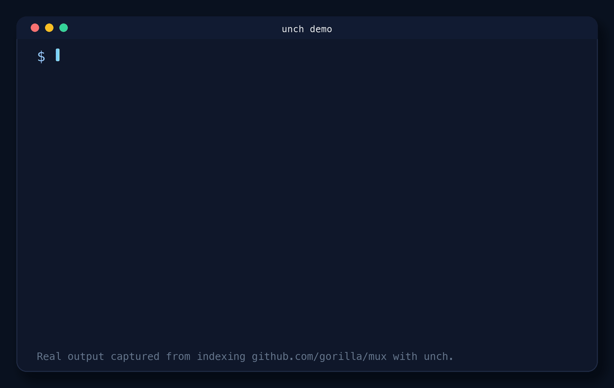

<p align="center">
  
</p>

# unch

[](https://github.com/uchebnick/unch/releases/latest)
[](https://github.com/uchebnick/homebrew-tap)
[](https://github.com/uchebnick/unch/actions/workflows/ci.yml)
[](https://github.com/uchebnick/unch)
[](https://unch.mintlify.app/)
[](https://t.me/unchnews)
[](https://t.me/unchchat)

**Semantic code search for code symbols and docs.**

`unch` indexes functions, methods, types, classes, interfaces, and attached docs with Tree-sitter, then lets you search them from the terminal. It is useful when you know what the code does, but not the symbol name or file path. Local indexing is the default; remote publishing is optional.

<p align="center">
  
</p>

## Why `unch`

- **Indexes symbols, not just lines.** `unch` stores top-level API objects and attached docs for `Go`, `TypeScript`, `JavaScript`, and `Python`.
- **Keeps the local workflow simple.** Build an index once, search from the CLI, and keep everything on your machine unless you explicitly publish a remote index.
- **Still works with CI.** If you want a shared index, GitHub Actions publishing is available, but it is not required for the normal local flow.

## Install

Homebrew on macOS:

```bash
brew install uchebnick/tap/unch
```

Release installer on macOS and Linux:

```bash
curl -fsSL https://raw.githubusercontent.com/uchebnick/unch/main/install.sh | sudo sh -s -- -b /usr/local/bin
```

This installs `unch` into a system `PATH` directory so you can run it immediately after the installer finishes.
On Apple Silicon macOS, use `/opt/homebrew/bin` instead of `/usr/local/bin`:

```bash
curl -fsSL https://raw.githubusercontent.com/uchebnick/unch/main/install.sh | sudo sh -s -- -b /opt/homebrew/bin
```

PowerShell installer on Windows:

```powershell
iwr https://raw.githubusercontent.com/uchebnick/unch/main/install/install.ps1 -useb | iex
```

Source install:

```bash
go install github.com/uchebnick/unch/cmd/unch@latest
```

This install path requires a cgo-capable Go toolchain. It is smoke-tested in CI in the official Debian-based Go container image. If `@latest` still resolves to the older pre-rename release line, use a release archive or build from the current checkout until the next tagged release is published.

If you want to build from the current checkout:

```bash
go build -o unch ./cmd/unch
```

Published release archives:

- macOS: `arm64`, `x86_64`
- Linux: `arm64`, `x86_64`
- Windows: `arm64`, `x86_64` (`unch.exe`)

On those targets, the installers use published release archives by default, so Go is not required. `install.sh` and `install/install.ps1` only fall back to `go install` when no matching archive is available. `install.sh` is smoke-tested in CI on Ubuntu, Debian, Arch, and NixOS-like environments, including the default no-`-b` path selection flow; the PowerShell installer is smoke-tested on Windows `arm64` and `x86_64`.

Verify the installed binary:

```bash
unch --version
unch --help
```

See [Compatibility](docs/compatibility.md) for the support matrix and upgrade rules, and [Benchmarks](docs/benchmarks.md) for the checked-in `smoke`, `ci`, and `default` suites.

Model selection accepts either a known model id or a direct `.gguf` path:

```bash
unch index --model embeddinggemma
unch index --model qwen3
unch search --model qwen3 "create a new router"
```

## Quick Start

```bash
cd path/to/repo
unch index --root .
unch search "create a new router"
unch search --details "get path variables from a request"
```

Real output from indexing [`gorilla/mux`](https://github.com/gorilla/mux):

```text
$ unch index --root .
Loaded model       dim=768
Indexed 278 symbols in 16 files

$ unch search "create a new router"
1. mux.go:32  0.7747
2. mux.go:314 0.8135

$ unch search --details "get path variables from a request"
1. mux.go:466  0.7991
   kind: function
   name: Vars
   signature: func Vars(r *http.Request) map[string]string
   docs: Vars returns the route variables for the current request, if any.
```

The first run may download the default embedding model, fetch local `yzma` runtime libraries, and create `./.semsearch/`.

Each model keeps its own active index snapshot. Rebuilding `qwen3` does not replace the active `embeddinggemma` snapshot until the new run finishes successfully.

## What It Supports Today

- Tree-sitter indexing for `Go`, `TypeScript`, `JavaScript`, and `Python`
- Top-level API objects and attached documentation
- Local indexing and search first, optional remote publishing through GitHub Actions
- `auto`, `semantic`, and `lexical` search modes
- Legacy `--comment-prefix` and `--context-prefix` only for `index` fallback on unsupported files or parser failures

## Core Commands

### `index`

Build or refresh the local index for a repository.

```bash
unch index --root .
```

Useful flags:

- `--exclude` to skip generated, vendor, or irrelevant paths
- `--model` to use `embeddinggemma`, `qwen3`, or a custom `.gguf` path
- `--ctx-size` to override the selected model context size; `0` uses the model default
- `--lib` to use an existing `yzma` runtime directory
- `--state-dir` to keep index state in a custom `.semsearch` directory

### `search`

Query the current index.

```bash
unch search "sqlite schema"
unch search --mode lexical "Run"
```

Useful flags:

- `--mode` for `auto`, `semantic`, or `lexical`
- `--limit` to control result count
- `--max-distance` to narrow semantic matches
- `--model` to search with `embeddinggemma`, `qwen3`, or a custom `.gguf` path
- `--ctx-size` to override the selected model context size; `0` uses the model default
- `--state-dir` to search against a custom `.semsearch` directory
- `--details` to print symbol metadata, signature, docs, and body context for each match

## Remote / CI

Remote indexing is optional. Use it when you want GitHub Actions to publish an index for a repository. The generated workflow file is `.github/workflows/unch-index.yml`.

Create the workflow scaffold:

```bash
unch create ci
```

Bind the local repository state to a GitHub repo or workflow URL:

```bash
unch bind ci https://github.com/uchebnick/unch
```

After the workflow is committed and runs successfully once, `unch search` can refresh the published index automatically when a newer remote version exists. Use `unch remote sync` when you want to force a refresh before searching.

The cross-platform benchmark matrix stays separate from ordinary push CI. It runs on release-tag pushes and manual `workflow_dispatch`, uses the checked-in `ci` suite with a lighter `1 cold / 1 warm / 1 search repeat` profile, and publishes per-platform summaries for Linux, macOS, and Windows.

## Contributing and Feedback

- See [CONTRIBUTING.md](CONTRIBUTING.md) for the local dev loop.
- Open a [bug report](https://github.com/uchebnick/unch/issues/new?template=bug_report.md) if search quality or indexing behavior looks wrong.
- Open a [feature request](https://github.com/uchebnick/unch/issues/new?template=feature_request.md) if you want new language support, ranking behavior, or workflow features.
